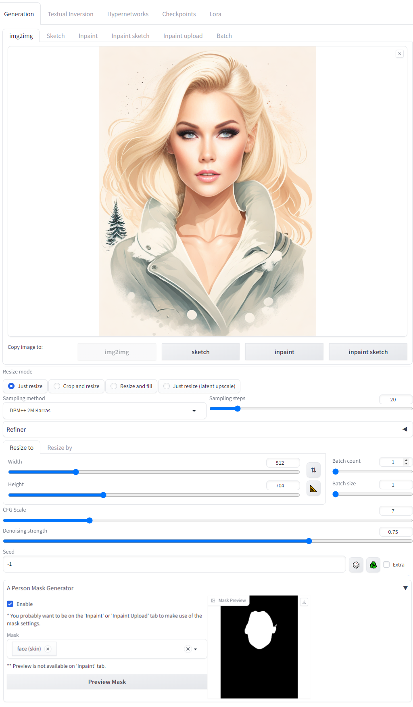
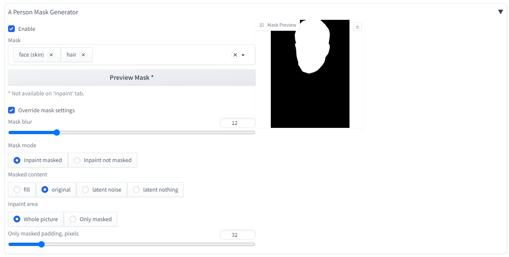

# a-person-mask-generator
Extension for Automatic1111 and ComfyUI to automatically create masks for Background/Hair/Body/Face/Clothes in Img2Img


## Install - Automatic1111 Web UI

(from Mikubill/sd-webui-controlnet)

1. Open "Extensions" tab.
2. Open "Install from URL" tab in the tab.
3. Enter `https://github.com/djbielejeski/a-person-mask-generator.git` to "URL for extension's git repository".
4. Press "Install" button.
5. Wait 5 seconds, and you will see the message "Installed into stable-diffusion-webui\extensions\a-person-mask-generator. Use Installed tab to restart".
6. Go to "Installed" tab, click "Check for updates", and then click "Apply and restart UI". (The next time you can also use this method to update extensions.)
7. Completely restart A1111 webui including your terminal. (If you do not know what is a "terminal", you can reboot your computer: turn your computer off and turn it on again.)


## Install - ComfyUI

1. Navigate to your ComfyUI folder, then into the `custom_nodes` folder in a `CMD` window and run the following command

```
git clone https://github.com/djbielejeski/a-person-mask-generator
```

### Example
```cmd
D:\ComfyUI\custom_nodes>git clone https://github.com/djbielejeski/a-person-mask-generator
```

2. Restart ComfyUI.


## Automatic1111 Examples

### Face


### Face + Body


### Clothes + Hair


### Mask Settings



## ComfyUI Example

Workflow embedded in image, drag into ComfyUI to use.

Masks in this order

1) Face
2) Background
3) Body + Clothes
4) Hair


